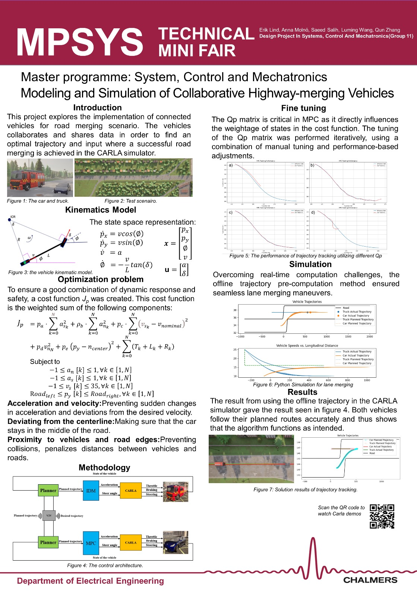
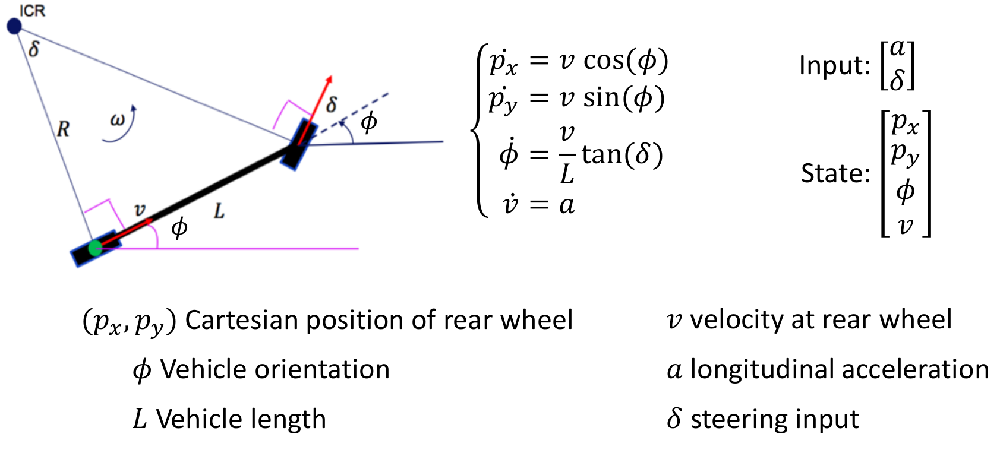
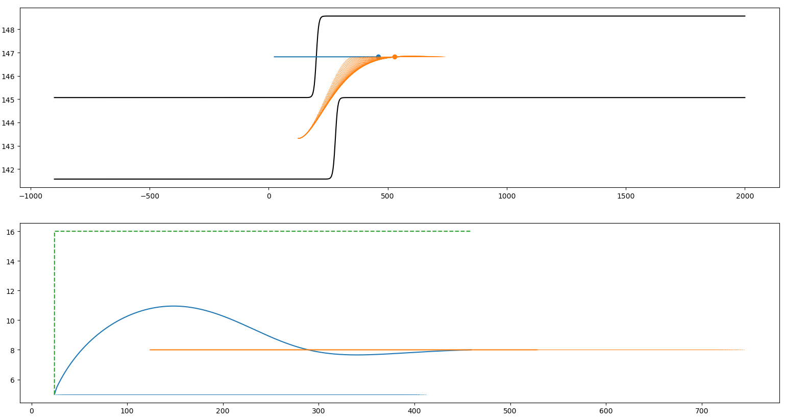
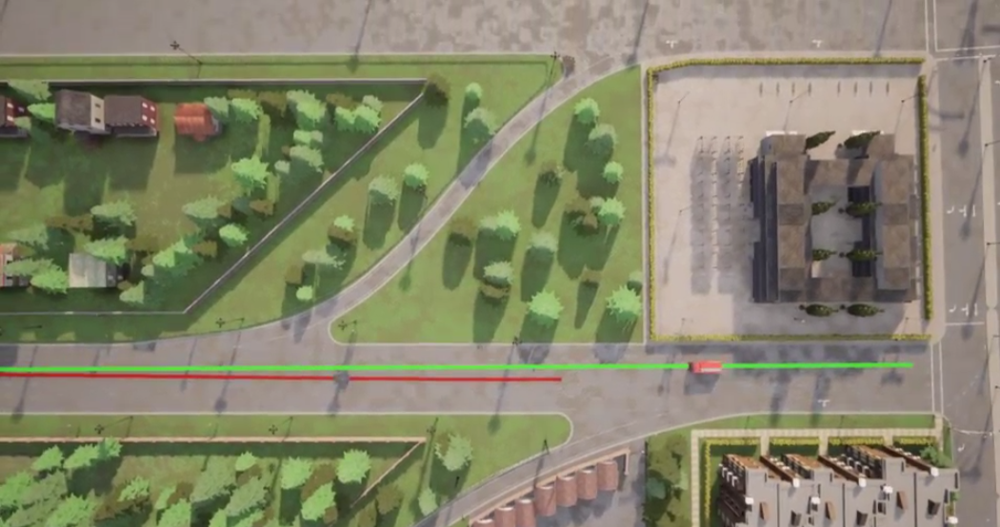

# SSY226_Project
This is for SSY226 design project from chalmers university of technology.

## link for papers:
https://ieeexplore.ieee.org/stamp/stamp.jsp?tp=&arnumber=9304813  
code from github: https://github.com/spc11400/lane-merging-algorithms

## reference paper
Reference paper pls check the reference paper folder

## link for our overleaf
This is the link for the overleaf:  
https://www.overleaf.com/project/655caa1f758cf35510b63e5d

## Tips:  
The lane merging code inside SSY226_Share is provided by Pavel. 

We use the vehicle kinematic model shown below for our control:  

"test_mpc.py" used set_point tracking to track the trajectory provided the waypoint of Carla.  

"mpc.py" used the trajectory(N=6) to track "sin" curve to test the performance of the MPC control, the mpc use the state space model shown below:  

Sadly, we failed to use carla to repeat the simulation in python. Because the throttle, brake and steering angle cannot be as accurate as in Python. And due to the real-time solution state, the lag in solving the QP problem prevents CARLA from controlling the vehicle's movement in a timely manner. We were not able to achieve direct control of the vehicle. DEMO demonstrations can only be achieved through trajectory tracking, which is not true V2V lane merging.

The video link is shown below:  
https://www.youtube.com/playlist?list=PLfi-srdJh5ddZDsl7bJtQfmNswJQYdw1R

## ToDo list:

