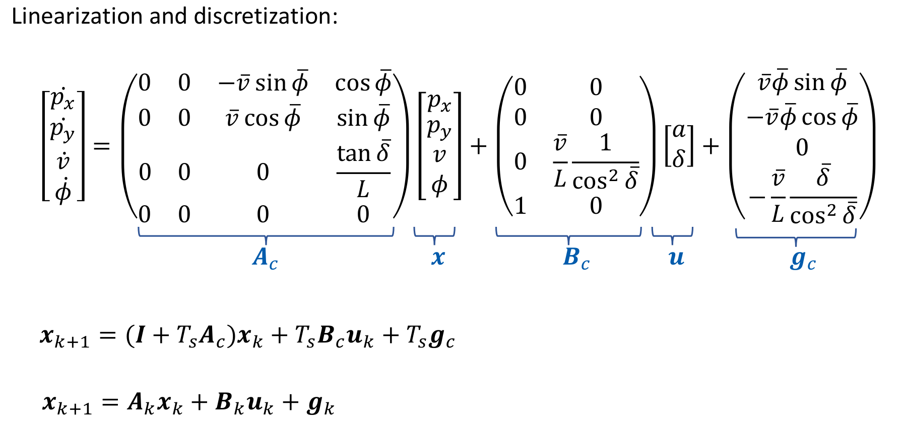

# SSY226_Project
This is for SSY226 design project from chalmers university of technology.
## repo for controller_python:  
https://github.com/Qunzhang1996/MotionPlanning-python
## link for papers:
https://ieeexplore.ieee.org/stamp/stamp.jsp?tp=&arnumber=9304813  
code from github: https://github.com/spc11400/lane-merging-algorithms
## link for our overleaf
This is the link for the overleaf:  
https://www.overleaf.com/project/655caa1f758cf35510b63e5d

## Tips:  
The lane merging code inside SSY226_Share is provided by Pavel.  

"test_mpc.py" used set_point tracking to track the trajectory provided the waypoint of Carla.  

"mpc.py" used the trajectory(N=6) to track "sin" curve to test the performance of the MPC control

